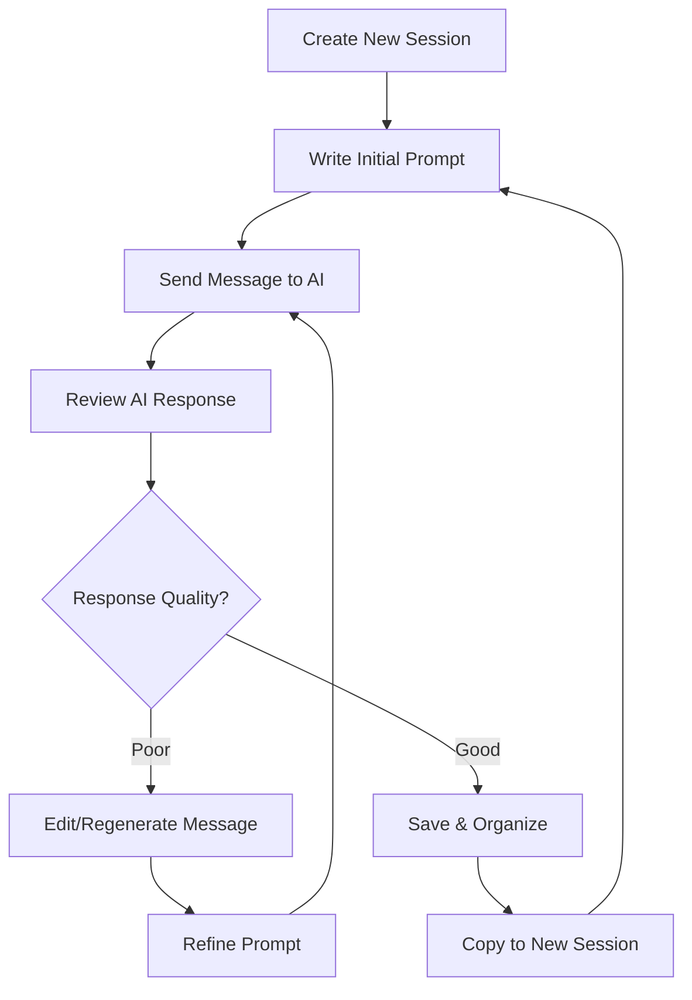
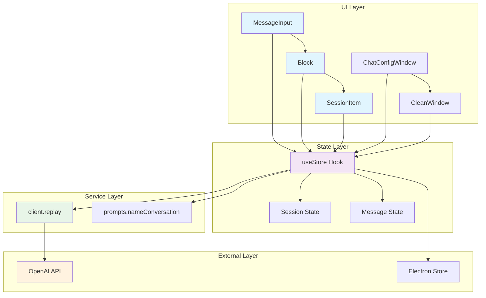
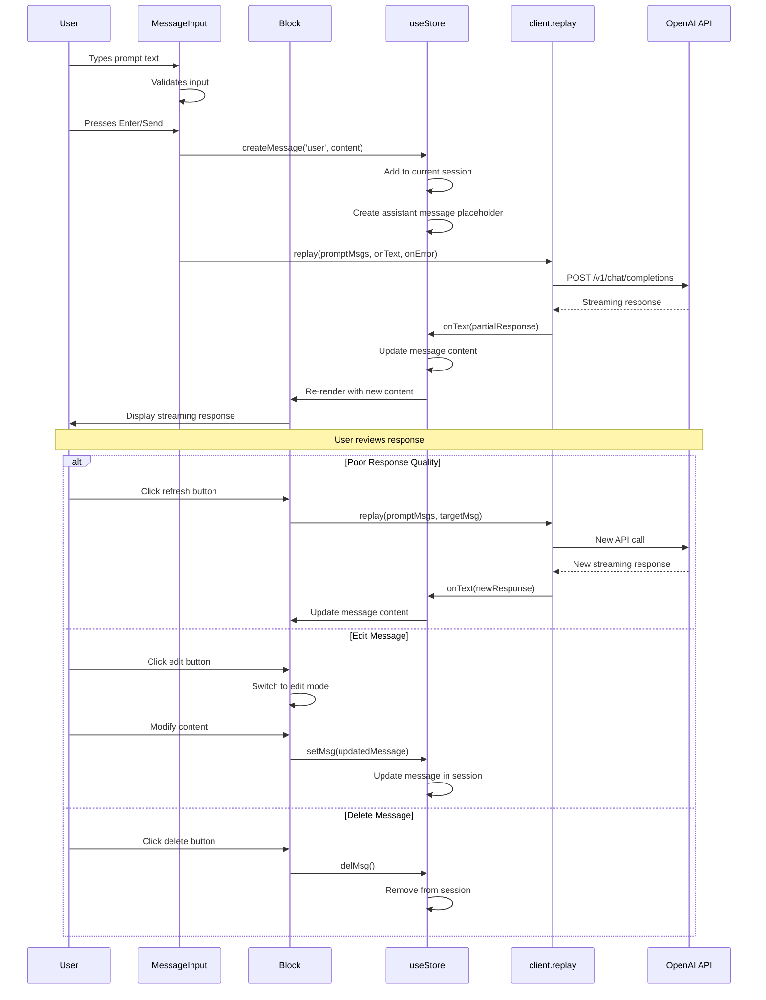

# Prompt Design & Debugging Lifecycle

**Use Case**: Prompt Design & Debugging  
**User Story**: As a developer, I want to design, test, and refine prompts iteratively so that I can optimize AI interactions and create effective prompt templates.

## Layer 1: User Journey Flow



## Layer 2: Component Architecture



### Component Mapping Table

| Component | Implementation | File:Line | Role |
|-----------|----------------|-----------|------|
| MessageInput | MessageInput function | App.tsx:416-461 | Handles user input and message submission |
| Block | _Block function | Block.tsx:64-238 | Renders individual messages with edit/delete actions |
| SessionItem | SessionItem component | SessionItem.tsx:29-97 | Manages session-level operations (rename, copy, delete) |
| ChatConfigWindow | ChatConfigWindow component | ChatConfigWindow.tsx:17-60 | Handles session renaming |
| CleanWindow | CleanWindow component | CleanWindow.tsx:14-34 | Manages session cleanup |
| useStore | useStore hook | store.ts:88-191 | Central state management for sessions and settings |
| client.replay | replay function | client.ts:4-95 | Handles API communication with streaming |
| prompts.nameConversation | nameConversation function | prompts.ts:3-25 | Generates session names from content |

## Layer 3: Detailed Interaction Flow



### Key Design Patterns

1. **Observer Pattern**: `useStore` acts as central state manager, components subscribe to state changes and re-render automatically
2. **Strategy Pattern**: `client.replay` handles different response scenarios (success, error) through callback functions
3. **Command Pattern**: User actions (edit, delete, regenerate) are encapsulated as functions passed down through props

## Data Structures

```typescript
// Core message structure with unique ID
interface Message {
    id: string;                    // UUID for message identification
    content: string;               // Actual message content
    role: 'user' | 'assistant' | 'system';  // Message role type
}

// Session container with messages array
interface Session {
    id: string;                    // UUID for session identification
    name: string;                  // Display name (auto-generated or manual)
    messages: Message[];           // Array of conversation messages
}

// Settings for API configuration
interface Settings {
    openaiKey: string;             // OpenAI API key
    apiHost: string;               // API endpoint URL
    showWordCount?: boolean;       // Display word count toggle
    showTokenCount?: boolean;      // Display token count toggle
    theme: ThemeMode;              // UI theme preference
}

// Block component props for message rendering
interface Props {
    msg: Message;                  // Message to display
    setMsg?: (msg: Message) => void;  // Update message callback
    delMsg?: () => void;           // Delete message callback
    refreshMsg?: () => void;       // Regenerate message callback
    copyMsg?: () => void;          // Copy message callback
    quoteMsg?: () => void;         // Quote message callback
}
```

## Quick Reference

### Event Triggers
- **Message Submission**: Enter key or Send button click
- **Message Regeneration**: Refresh button click on assistant messages
- **Message Editing**: Edit button click → TextField edit → Check button
- **Message Deletion**: Delete button in message menu
- **Session Renaming**: Edit button in session menu → ChatConfigWindow

### Data Formats
- **API Request**: JSON with `messages`, `model: "gpt-3.5-turbo"`, `stream: true`
- **API Response**: Server-sent events with `data: {...}` format
- **Local Storage**: Electron Store with keys `'chat-sessions'` and `'settings'`

### Error Handling
- **API Errors**: Displayed in message content as `'API Request Failed: \n```\n' + err.message + '\n```'`
- **Empty Input**: Prevented by length validation in MessageInput
- **Network Issues**: Handled by client.replay error callback

## Related Lifecycles

1. **Conversation Management** - Session creation, switching, and organization
2. **OpenAI API Testing** - Basic API interaction and response handling  
3. **Local Data Storage** - Persistent storage of sessions and settings
4. **Cost-Effective AI Access** - Usage tracking and API configuration
5. **Developer Workflows** - Code formatting, markdown rendering, and technical features

## Component Overview

### Key Components
- **MessageInput**: Primary user interaction point for prompt creation
- **Block**: Individual message renderer with full CRUD operations
- **useStore**: Central state management with local persistence
- **client.replay**: API communication layer with streaming support

### Key Services  
- **Session Management**: Create, update, delete, and switch between conversations
- **Message Operations**: Edit, regenerate, copy, quote, and delete messages
- **API Integration**: Streaming communication with OpenAI API
- **Auto-naming**: AI-generated session titles based on conversation content

### Data Flow Summary
1. User input → MessageInput → useStore → Session state update
2. Message submission → client.replay → OpenAI API → Streaming response
3. Response updates → useStore → Block re-render → User sees result
4. User actions (edit/delete/regenerate) → Block → useStore → State update
5. All changes → Electron Store → Local persistence
