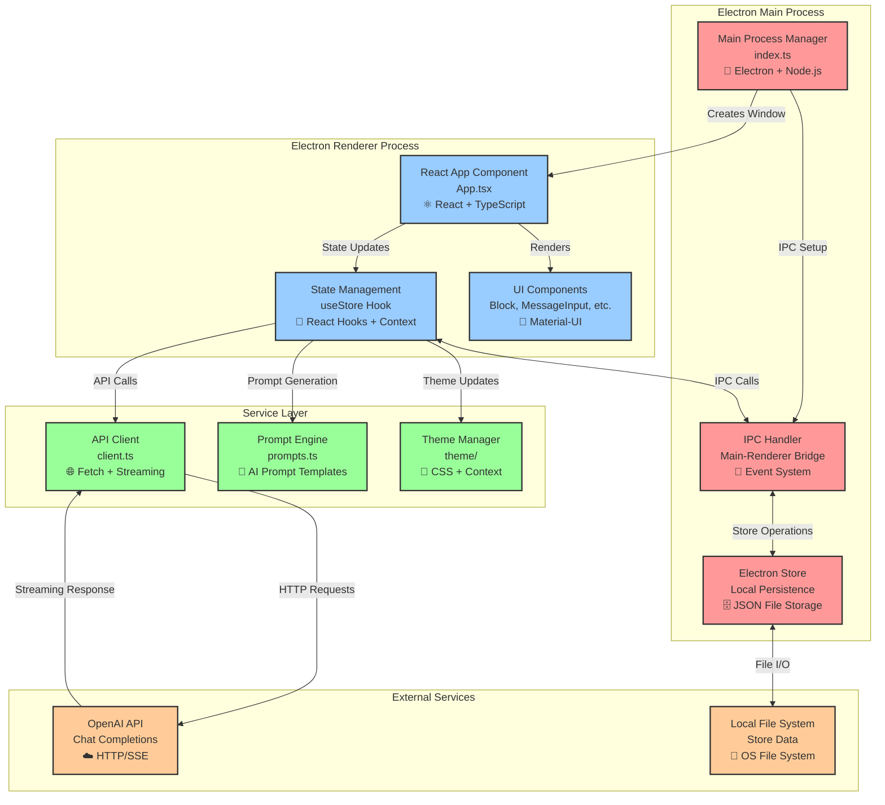

# Chatbox System Architecture Overview

## 1. System Overview Diagram

## 2. Component Catalog

| Component Name | Technology/Framework | Primary Responsibility | Key Files | Heavy Logic |
|----------------|---------------------|------------------------|-----------|-------------|
| **Main Process Manager** | Electron + Node.js | Application lifecycle, window management, IPC setup | `src/index.ts:16-91` | Window creation, security headers, auto-updater integration |
| **Electron Store** | electron-store | Local data persistence with JSON file storage | `src/index.ts:83-91` | Session/settings serialization, file I/O operations |
| **IPC Handler** | Electron IPC | Secure communication bridge between main/renderer | `src/preload.ts:7-22` | Context isolation, event routing, security sandboxing |
| **React App Component** | React + TypeScript | Main UI orchestration and component coordination | `src/devtools/App.tsx:28-413` | Component lifecycle, event handling, layout management |
| **State Management** | React Hooks + Context | Centralized state with local persistence | `src/devtools/store.ts:88-191` | Session management, settings sync, reactive updates |
| **API Client** | Fetch + Streaming | OpenAI API communication with real-time streaming | `src/devtools/client.ts:4-95` | SSE parsing, error handling, token management |
| **UI Components** | Material-UI + React | Rich message rendering and user interactions | `src/devtools/Block.tsx:64-238` | Markdown rendering, edit modes, CRUD operations |
| **Prompt Engine** | Custom Templates | AI prompt generation and conversation naming | `src/devtools/prompts.ts:3-25` | Template processing, content analysis |
| **Theme Manager** | React Context + CSS | Dynamic theming and system theme integration | `src/devtools/theme/` | Theme switching, system integration, CSS management |

## 3. Technology Stack

### UI Layer
- **React 18.2.0** - Component framework with hooks and context
- **Material-UI 5.11.11** - Component library with theming
- **TypeScript 4.5.4** - Type-safe development
- **SCSS** - Styling with CSS preprocessing

### State/Logic Layer  
- **React Hooks** - State management with useState/useEffect
- **Context API** - Theme and global state sharing
- **UUID** - Unique identifier generation
- **Custom Hooks** - useStore for centralized state

### Service/API Layer
- **Fetch API** - HTTP client for OpenAI communication
- **Server-Sent Events** - Real-time streaming responses
- **Custom Client** - client.ts with streaming and error handling
- **Prompt Templates** - Dynamic prompt generation

### Data Layer
- **Electron Store** - Local JSON file persistence
- **IPC (Inter-Process Communication)** - Main/renderer communication
- **Context Bridge** - Secure API exposure

### External Dependencies
- **OpenAI API** - GPT model access via HTTP/SSE
- **Electron 23.1.2** - Desktop application framework
- **Node.js** - Main process runtime
- **Webpack** - Module bundling and hot reload

## 4. Integration Points

### Main ↔ Renderer Communication
- **Protocol**: Electron IPC (Inter-Process Communication)
- **Data Format**: JSON serialization
- **Sync/Async**: Async (ipcRenderer.invoke/ipcMain.handle)
- **Security**: Context isolation via preload script

### Renderer ↔ External API
- **Protocol**: HTTP/HTTPS with Server-Sent Events
- **Data Format**: JSON requests, SSE streaming responses
- **Sync/Async**: Async with real-time streaming
- **Error Handling**: Custom error callbacks and user-friendly display

### State ↔ Persistence
- **Protocol**: Electron Store API via IPC
- **Data Format**: JSON with automatic serialization
- **Sync/Async**: Async with reactive updates
- **Storage**: Local file system with automatic file management

### UI ↔ State Management
- **Protocol**: React Context and props
- **Data Format**: TypeScript interfaces
- **Sync/Async**: Synchronous with reactive re-rendering
- **Pattern**: Observer pattern with automatic component updates

## 5. Where to Start

### To Understand User Interactions
- **Read**: `001_lifecycle_prompt_design_debugging.md` - Complete user journey flow
- **Start with**: `src/devtools/App.tsx` - Main UI orchestration and event handling

### To Understand Data Flow  
- **Start with**: `src/devtools/store.ts` - Central state management and persistence
- **Follow**: Data flow from UI → State → IPC → Store → File System

### To Understand Business Logic
- **Start with**: `src/devtools/client.ts` - API communication and streaming logic
- **Follow**: Prompt processing → API calls → Response handling → UI updates

### To Understand System Architecture
- **Start with**: `src/index.ts` - Main process setup and IPC configuration
- **Follow**: Application lifecycle → Window creation → IPC setup → Renderer bootstrap

### To Understand External Integration
- **Start with**: `src/devtools/client.ts` - OpenAI API integration patterns
- **Follow**: Authentication → Request formatting → Streaming → Error handling

## Key Architecture Patterns

1. **Electron Multi-Process**: Main process for system integration, renderer for UI
2. **React State Management**: Centralized state with hooks and context
3. **IPC Communication**: Secure bridge between main and renderer processes  
4. **Streaming Architecture**: Real-time API responses with Server-Sent Events
5. **Local-First Storage**: Electron Store with automatic persistence
6. **Component Composition**: Material-UI components with custom business logic
7. **Error Boundary Pattern**: Graceful error handling throughout the stack

## Deployment Architecture

- **Single Executable**: Electron app packaged for Mac/Windows/Linux
- **Local Storage**: JSON files in user data directory
- **No Server Required**: Direct API communication with OpenAI
- **Auto-Updates**: Built-in update mechanism via electron-updater
- **Cross-Platform**: Native desktop experience on all major platforms

